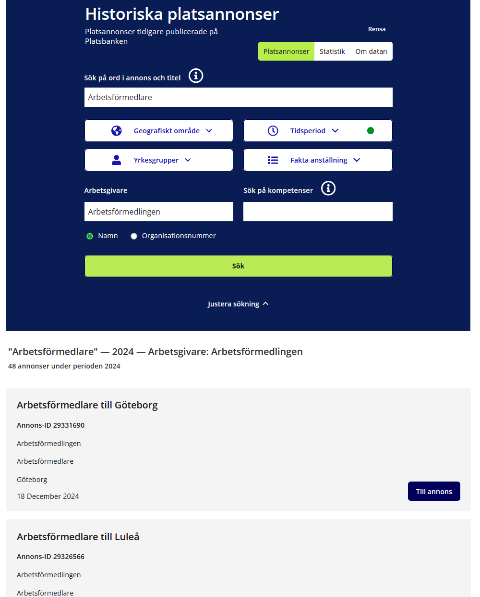
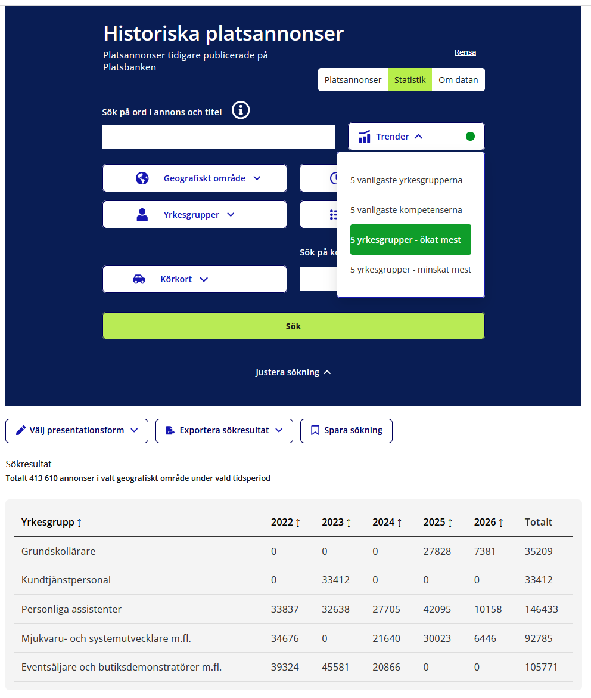
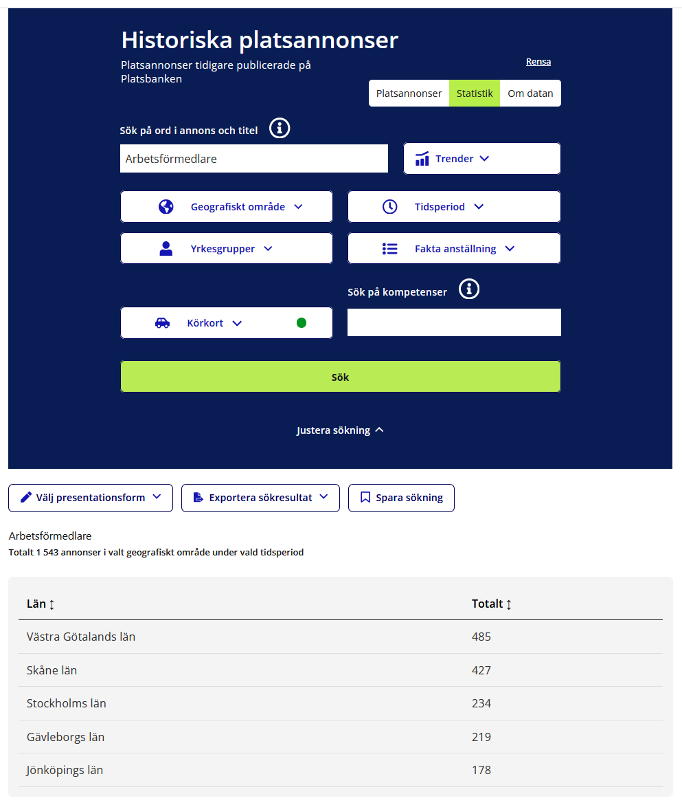
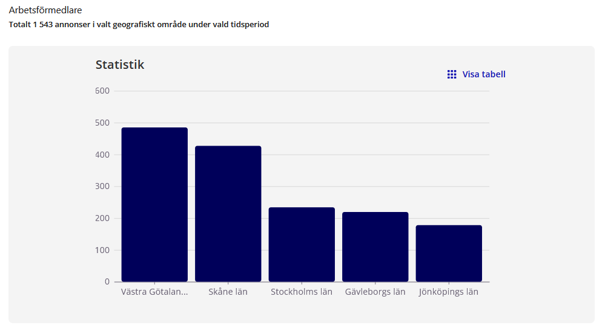

# Historiska platsannonser — frontend

Omarbetad webbklient för att utforska **historiska platsannonser** som tidigare publicerats via Arbetsförmedlingen (t.ex. Platsbanken), utifrån **öppna data**. Applikationen följer Arbetsförmedlingens designsystem **Digi** (`@designsystem-se/af`) för ett konsekvent och tillgängligt gränssnitt.

> **OBS:** Detta repo innehåller bara frontend. API-anrop går mot en separat backend.

- [Historical Ads Rework Backend](https://github.com/Letssdothiss/historical-ads-frontend-rework-BACKEND)

## Exempel från applikationen

 

 

## Funktioner (översikt)

- **Platsannonser** — sökformulär med filter (fritext, geografi, yrkesområden m.m.), resultatlista och relaterad logik under `src/features/jobAds/`.
- **Statistik** — diagram, filter och dataflöde under `src/features/statistics/` (kopplad till statistik-API).
- **Gemensamt skal** — startsida med blå “shell”, fliknavigering och layoutkomponenter under `src/shared/` och `src/pages/`.

## Teknikstack

| Område      | Val                                                                                                                           |
| ----------- | ----------------------------------------------------------------------------------------------------------------------------- |
| UI          | React 19, Vite 8                                                                                                              |
| Routing     | React Router 7                                                                                                                |
| Design      | [Digi — Arbetsförmedlingen](https://designsystem.arbetsformedlingen.se/) (`@designsystem-se/af`, `@designsystem-se/af-react`) |
| HTTP        | Axios (`src/shared/api/HttpClient.js`)                                                                                        |
| Tester      | Vitest, Testing Library, [MSW](https://mswjs.io/)                                                                             |
| Kodkvalitet | ESLint, Prettier, GitHub Actions                                                                                              |
| Övrigt      | `@taxonomy/yrkesvaljaren` (Ej implementerad i nuvarande iteration.)                                                           |

## Kom igång

```bash
npm install
npm run dev
```

Applikationen startar normalt på [http://localhost:5173](http://localhost:5173).

### Miljövariabler

Backend-adress styrs av **`VITE_API_BASE_URL`** (se `src/shared/api/HttpClient.js`). Standard om variabel saknas: `http://localhost:5000/api/v1`.

Kopiera `.env.example` till `.env.local` och justera vid behov.

## NPM-skript

| Kommando                   | Beskrivning                |
| -------------------------- | -------------------------- |
| `npm run dev`              | Utvecklingsserver med HMR  |
| `npm run build`            | Produktionsbygge           |
| `npm run preview`          | Förhandsvisning av bygge   |
| `npm run lint`             | ESLint                     |
| `npm run format`           | Prettier (skriv över)      |
| `npm run format:check`     | Prettier (endast kontroll) |
| `npm run test`             | Vitest (watch)             |
| `npm run test:run`         | Vitest en gång             |
| `npm run test:ui`          | Vitest med webb-UI         |
| `npm run test:coverage`    | Tester + coverage-rapport  |
| `npm run test:coverage:ui` | Coverage i Vitest UI       |

## Tester

Automatiska tester körs med Vitest och Testing Library. Enhetstester ligger under `src/**/tests/`; integrationstester och MSW-setup under `tests/`.

Mer om struktur, kommandon och coverage: **[tests/TESTING.md](tests/TESTING.md)**.

```bash
npm run test:run
npm run test:coverage   # rapport i coverage/ (öppna coverage/index.html)
```

## CI

Vid push och pull request körs [GitHub Actions](.github/workflows/ci.yml) (Node 22):

`npm ci` → `lint` → `format:check` → `test:run` → `build`

## Projektstruktur (förenklad)

```
src/
  app/           # App-shell, router, layout
  pages/         # Sidor (t.ex. startsida, resultat)
  features/
    jobAds/      # Platsannonser: formulär, filter, API, hooks
    statistics/  # Statistik: formulär, diagram, API, hooks
  shared/        # Återanvända komponenter, HttpClient, hooks, utils, global CSS
  assets/
tests/           # Integrationstester, MSW, setup (se TESTING.md)
```

Nya UI-delar placeras gärna som **egen mapp per komponent** (`Komponentnamn/Komponentnamn.jsx` + `.css`).

## API mot backend

Alla anrop går via `HttpClient` med bas-URL från `VITE_API_BASE_URL`.

**Platsannonser** — `jobAdsApi` (`src/features/jobAds/api/jobAdsApi.js`):

- `GET /search` — sökning
- `GET /search/ad/:id` — annonsdetalj
- `GET /filters` — filtermetadata
- `GET /export` — export
- `GET /share-url` — delningslänk

**Statistik** — `StatisticsApi` (`src/features/statistics/api/StatisticsApi.js`):

- `GET /stats` — statistikdata
- `GET /export` — export av statistik (filnedladdning)

Exakta paths beror på hur backend är monterad; justera `VITE_API_BASE_URL` om API:t ligger på annan bas-URL.

## Data och ansvar

Öppna data och presentation av historiska annonser ska följas av **källhänvisning** och respekt för Arbetsförmedlingens villkor för den aktuella datamängden. Detta repo beskriver inte själva datasetet; se er produktdokumentation eller datakatalog.

## Användning av Generativ AI

I detta projekt har generativ AI såsom cursor och co-pilot använts som stöd för:

- Dokumentation.
- Problemlösning i skrift.
- Problemlösning i kod.
- Implementation bitvis.
- Viss automatiserad testning.

<i>Allt material som genererats med hjälp av AI har blivit granskat och testat av projektgruppen.</i>

## Länkar

- [Digi — komponenter och riktlinjer](https://designsystem.arbetsformedlingen.se/)
- [Vite — dokumentation](https://vite.dev/)
- [React — dokumentation](https://react.dev/)
- [Vitest — dokumentation](https://vitest.dev/)
- [Standard for Public Code](https://standard.publiccode.net/)

## License

[Apache License 2.0](./LICENSE)
