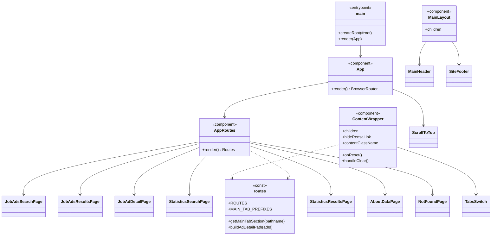
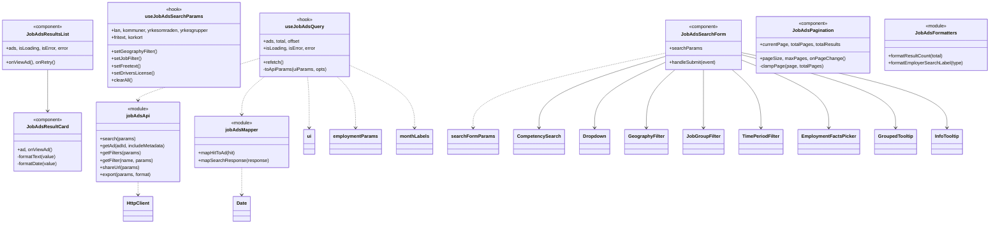
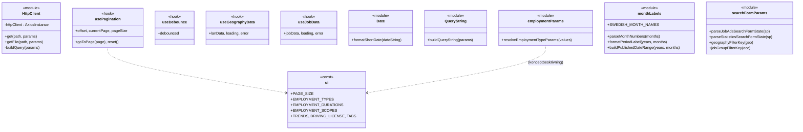
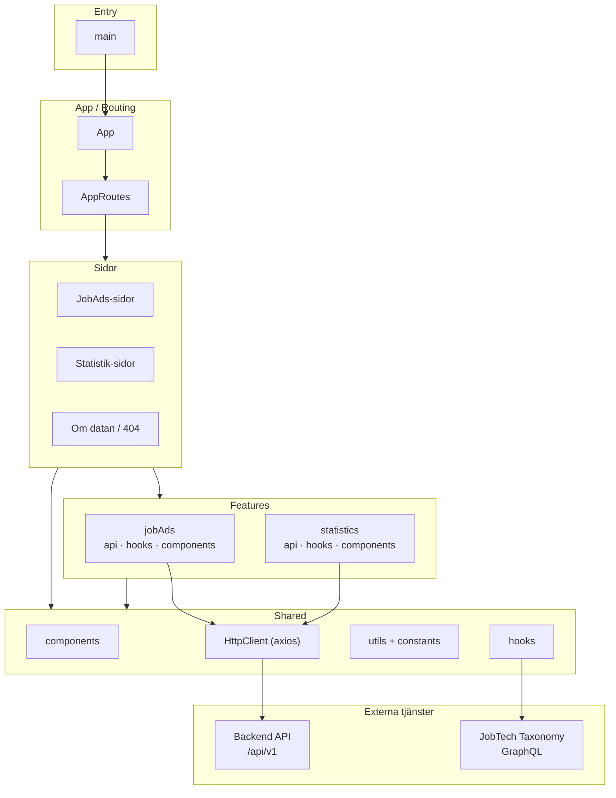

# Klassdiagram – Historiska platsannonser (Frontend)

> Projektet är byggt i **React 19** med funktionskomponenter och hooks (inga
> ES-klasser). I diagrammen nedan modelleras därför varje **komponent**, **hook**
> och **modul** som en "klass" i UML-mening:
>
> - `<<component>>` = React-komponent — **attribut = props**, **metoder = interna funktioner/handlers**
> - `<<hook>>` = custom hook — attribut = returnerat state, metoder = exponerade funktioner
> - `<<module>>` = ren JS-modul (api/utils/mapper) — metoder = exporterade funktioner
> - `<<const>>` = konstant-/konfigurationsmodul
>
> Relationspilar:
> - `-->` "renderar / komponerar" (en komponent renderar en annan)
> - `..>` "använder / importerar" (beroende på hook, util, api)
> - `--|>` används ej (ingen arvshierarki finns)

---

## 1. Översikt – applikations- och routinglager



---

## 2. Sidor (Pages)

```mermaid
classDiagram
    direction TB

    class JobAdsSearchPage {
        <<component>>
    }
    class JobAdsResultsPage {
        <<component>>
        -page : number
        -adjustOpen : bool
        -uiParams
        +readUiParamsFromUrl(searchParams)
        +buildSummary(params)
        +handleViewAd(ad)
    }
    class JobAdDetailPage {
        <<component>>
        -isLoading, error, ad, metadata
        +adReducer(state, action)
        +mergeQualifications(source)
        +readResultContext()
        +backToResults()
        +goNextAd()
    }
    class StatisticsSearchPage {
        <<component>>
    }
    class StatisticsResultsPage {
        <<component>>
        -data, yearResults
        -isLoading, error, adjustOpen
        +readUiParamsFromUrl(searchParams)
    }
    class AboutDataPage {
        <<component>>
    }
    class HomePage {
        <<component>>
        %% ej registrerad i AppRoutes
    }
    class NotFoundPage {
        <<component>>
    }

    JobAdsSearchPage --> MainLayout
    JobAdsSearchPage --> ContentWrapper
    JobAdsSearchPage --> JobAdsSearchForm

    JobAdsResultsPage --> MainLayout
    JobAdsResultsPage --> ContentWrapper
    JobAdsResultsPage --> ResultsAdjustSearch
    JobAdsResultsPage --> JobAdsSearchForm
    JobAdsResultsPage --> JobAdsResultsList
    JobAdsResultsPage --> JobAdsPagination
    JobAdsResultsPage ..> useJobAdsQuery
    JobAdsResultsPage ..> routes
    JobAdsResultsPage ..> ui

    JobAdDetailPage --> MainLayout
    JobAdDetailPage --> ContentWrapper
    JobAdDetailPage --> ErrorState
    JobAdDetailPage ..> jobAdsApi
    JobAdDetailPage ..> jobAdsMapper
    JobAdDetailPage ..> routes

    StatisticsSearchPage --> MainLayout
    StatisticsSearchPage --> ContentWrapper
    StatisticsSearchPage --> StatisticsSearchForm

    StatisticsResultsPage --> MainLayout
    StatisticsResultsPage --> ContentWrapper
    StatisticsResultsPage --> ResultsAdjustSearch
    StatisticsResultsPage --> StatisticsSearchForm
    StatisticsResultsPage --> StatisticsChartPanel
    StatisticsResultsPage ..> StatisticsApi
    StatisticsResultsPage ..> StatisticsMapper

    AboutDataPage --> MainLayout
    AboutDataPage --> ContentWrapper
    HomePage --> MainLayout
    HomePage --> ContentWrapper
    HomePage --> JobAdsSearchForm
    NotFoundPage --> MainLayout
```



---

## 3. Feature: jobAds (platsannonser)



---

## 4. Feature: statistics (statistik)

```mermaid
classDiagram
    direction TB

    class StatisticsApi {
        <<module>>
        +fetchStatistics(params)
        +exportStatistics(params, format)
        -toBaseApiParams(params)
        -toDrivingLicenseRequired(value)
    }
    class StatisticsMapper {
        <<module>>
        +mapStatisticsResponse(yearResults)
        +mapStatisticsByMonth(yearResults)
        +mapStatisticsByMunicipality(yearResults)
        -extractRegions(raw)
        -parseMonthLabel(label)
    }
    class useStatisticsParams {
        <<hook>>
        +params, setParams(), hasParams
    }
    class useStatisticsQuery {
        <<hook>>
        +data, loading, error
    }
    class StatisticsSearchForm {
        <<component>>
        +searchParams
        +handleSubmit(event)
    }
    class StatisticsChartPanel {
        <<component>>
        +data, yearResults, searchParams
        -visning, enhet, pivot, detailLevel
        -sortCol, sortDir, exportFormat, toast
        +handleSort(col)
        +handleExport(format)
        +saveSearch()
        -buildSummary(params)
    }
    class BarChart {
        <<component>>
        +data, stacked
    }
    class LineChart {
        <<component>>
        +data
    }
    class PieChart {
        <<component>>
        +data
    }
    class DrivingLicenseFilter {
        <<component>>
        +value, onChange()
        -deriveChecks(value)
        -toValue(checks)
    }
    class TrendsFilter {
        <<component>>
        +value, onChange()
    }
    class StatisticsTransformers {
        <<module>>
        +toBarChartData(data, options)
        +toChartData(data, options)
        +toAndel(data)
    }
    class chartUtils {
        <<module>>
        +chartMaxWidth(categoryCount)
    }

    StatisticsApi ..> HttpClient
    StatisticsApi ..> employmentParams
    useStatisticsQuery ..> StatisticsApi
    useStatisticsQuery ..> StatisticsMapper

    StatisticsChartPanel ..> StatisticsApi
    StatisticsChartPanel ..> StatisticsMapper
    StatisticsChartPanel ..> StatisticsTransformers
    StatisticsChartPanel ..> monthLabels
    StatisticsChartPanel --> BarChart
    StatisticsChartPanel --> LineChart

    BarChart ..> StatisticsTransformers
    BarChart ..> chartUtils
    LineChart ..> StatisticsTransformers
    PieChart ..> StatisticsTransformers

    StatisticsSearchForm ..> searchFormParams
    StatisticsSearchForm --> CompetencySearch
    StatisticsSearchForm --> Dropdown
    StatisticsSearchForm --> GeographyFilter
    StatisticsSearchForm --> JobGroupFilter
    StatisticsSearchForm --> TimePeriodFilter
    StatisticsSearchForm --> EmploymentFactsPicker
    StatisticsSearchForm --> DrivingLicenseFilter
    StatisticsSearchForm --> TrendsFilter
    StatisticsSearchForm --> GroupedTooltip
    StatisticsSearchForm --> InfoTooltip
```



---

## 5. Delade resurser (shared) – api, hooks, utils, konstanter



---

## 6. Delade UI-komponenter (shared/components)

```mermaid
classDiagram
    direction TB

    class GeographyFilter {
        <<component>>
        +onClose(), onApply()
        +initialLan, initialKommuner
        +handleApply()
        +toggleKommun(), toggleAllaLan()
    }
    class JobGroupFilter {
        <<component>>
        +onClose(), onApply()
        +initialAreas, initialGroups
        +handleApply()
        +toggleGroup(), toggleAllaAreas()
    }
    class TimePeriodFilter {
        <<component>>
        +onChange(), initialPeriod
        +handleYearClick(), handleMonthClick()
        -getTimePeriodPayload()
        -applyTimePeriodValue()
    }
    class EmploymentFactsPicker {
        <<component>>
        +value, onChange()
        +toggleSectionOption()
        +toggleAllForSection()
    }
    class CompetencySearch {
        <<component>>
        +value, onChange()
    }
    class Dropdown {
        <<component>>
        +trigger, children, isOpen, onClose()
    }
    class GroupedTooltip {
        <<component>>
        +title, grouped
    }
    class InfoTooltip {
        <<component>>
        +label, children
    }
    class FilterIndicator {
        <<component>>
        +heading, groups
    }
    class ResultsAdjustSearch {
        <<component>>
        +open, onToggle(), children
    }
    class MainHeader {
        <<component>>
    }
    class TabsSwitch {
        <<component>>
    }
    class SiteFooter {
        <<component>>
    }
    class ScrollToTop {
        <<component>>
    }
    class ErrorState {
        <<component>>
        +title, message, onRetry()
    }
    class LoadingState {
        <<component>>
        +text
    }
    class SkeletonLoader {
        <<component>>
    }
    class ResultCount {
        <<component>>
        +count
    }

    GeographyFilter ..> useGeographyData
    JobGroupFilter ..> useJobData
    EmploymentFactsPicker ..> ui
    CompetencySearch --> InfoTooltip
    TabsSwitch ..> routes
    ScrollToTop ..> routes
```



---

## 7. Beroendekarta på hög nivå (lager)



---

### Anteckningar

- **`HomePage`** finns men är **inte** kopplad i `AppRoutes` (roten `/`
  redirectar till `/platsannonser`). Den behålls i diagrammet för fullständighet.
- **`useJobAdsSearchParams`**, **`useStatisticsParams`**, **`useStatisticsQuery`**,
  **`usePagination`**, **`useDebounce`**, **`FilterIndicator`**, **`ResultCount`**,
  **`LoadingState`**, **`SkeletonLoader`** och **`JobAdsFormatters`** existerar i
  kodbasen men anropas inte från de aktiva sidorna/formulären (resultatsidorna
  läser URL-parametrar direkt och anropar `fetch*`-API:erna). De är ritade som
  fristående "klasser" utan inkommande renderingspilar.
- Två separata GraphQL-hooks (`useGeographyData`, `useJobData`) hämtar län/kommun
  respektive yrkesområde/yrkesgrupp direkt från **JobTech Taxonomy**.
- All backend-kommunikation går genom **`HttpClient`** (en delad axios-instans
  med response-interceptor för felhantering).
```
