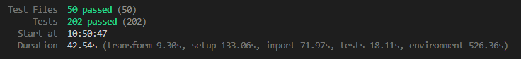
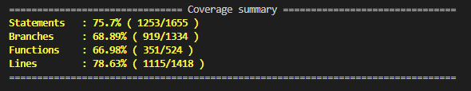

# Testing

Vitest + Testing Library. **Unit tests** mirror source under `src/**/tests/`. **Integration tests** in this folder use [MSW](https://mswjs.io/) for page-level flows.

## Integration (this folder)

| Path                           | Purpose                                             |
| ------------------------------ | --------------------------------------------------- |
| `setup.js`                     | Global setup (jest-dom + MSW server lifecycle)      |
| `mocks/handlers.js`            | Default API handlers (`/search`, `/stats`)          |
| `mocks/server.js`              | MSW `setupServer`                                   |
| `utils/renderWithRouter.jsx`   | Render a page at a URL with `MemoryRouter`          |
| `utils/digiReactMock.jsx`      | Digi stubs for jsdom                                |
| `pages/*.integration.test.jsx` | Page integration + smoke tests (results pages, 404) |

**7 tests** in `tests/pages/`.

## Feature jobAds

Unit tests for `src/features/jobAds/` — search, results UI, URL params, and API mapping. Shared filters (`JobGroupFilter`, geography, etc.) are **mocked** in form tests; they are tested under `src/shared/tests/`.

**Path:** `src/features/jobAds/tests/` · **49 tests**

| Folder        | Covers                                                                          |
| ------------- | ------------------------------------------------------------------------------- |
| `api/`        | `jobAdsApi`, `jobAdsMapper` (search response → UI ads)                          |
| `components/` | `JobAdsSearchForm`, `JobAdsResultsList`, `JobAdsResultCard`, `JobAdsPagination` |
| `hooks/`      | `useJobAdsQuery` (UI params → API + fetch), `useJobAdsSearchParams` (URL sync)  |
| `utils/`      | `jobAdsFormatters`                                                              |

```bash
npm run test:run -- src/features/jobAds/tests
```

## Feature statistics

Unit tests for `src/features/statistics/` — search form, chart panel, stats API, and transformers. Same pattern as job ads: shared filters are mocked in `StatisticsSearchForm` tests.

**Path:** `src/features/statistics/tests/` · **51 tests**

| Folder        | Covers                                                                                                                                       |
| ------------- | -------------------------------------------------------------------------------------------------------------------------------------------- |
| `api/`        | `StatisticsApi`, `StatisticsMapper` (`/stats`, year aggregates, export)                                                                      |
| `components/` | `StatisticsSearchForm`, `StatisticsChartPanel`, `TrendsFilter`, `DrivingLicenseFilter`, chart wrappers (`BarChart`, `LineChart`, `PieChart`) |
| `hooks/`      | `UseStatisticsParams`, `UseStatisticsQuery` (not wired on results page yet)                                                                  |
| `utils/`      | `StatisticsTransformers`                                                                                                                     |

```bash
npm run test:run -- src/features/statistics/tests
```

## Shared

Unit tests for `src/shared/` — HTTP client, routes, hooks, filters, and shell components used by both Platsannonser and Statistik.

**Path:** `src/shared/tests/` · **61 tests**

| Folder        | Covers                                                                                                                                                                  |
| ------------- | ----------------------------------------------------------------------------------------------------------------------------------------------------------------------- |
| `api/`        | `HttpClient` (`get`, `getFile`, query building, errors)                                                                                                                 |
| `components/` | Filters (`GeographyFilter`, `JobGroupFilter`, `TimePeriodFilter`, …), shell (`ContentWrapper`, `TabsSwitch`, `ScrollToTop`), feedback (`LoadingState`, `ErrorState`, …) |
| `hooks/`      | `useJobData`, `useGeographyData`, `useDebounce`, `usePagination`                                                                                                        |
| `utils/`      | `Date`, `QueryString`                                                                                                                                                   |
| `constants/`  | `routes` (`getMainTabSection`, `buildAdDetailPath`)                                                                                                                     |

Not covered here (manual / smoke only): `mainHeader`, `siteFooter`, static `ui.js` lists.

```bash
npm run test:run -- src/shared/tests
```

## Run

```bash
# All suites (unit + integration)
npm run test:run

# Integration only (this folder)
npm run test:run -- tests/pages

# Unit tests by feature / shared
npm run test:run -- src/features/jobAds/tests
npm run test:run -- src/features/statistics/tests
npm run test:run -- src/shared/tests
```

## Vitest UI (browser)

`@vitest/ui` is already installed. It opens a **local web UI** (separate browser tab/window) with a test tree, filters, re-run, and per-test output — useful while writing tests.

```bash
npm run test:ui              # watch mode + UI (stays open)
npm run test:coverage:ui     # UI with coverage overlay
```

Press `q` in the terminal or stop the process when you are done.

## Coverage

Uses `@vitest/coverage-v8`. Reports land in `coverage/` (HTML report: open `coverage/index.html` in a browser).

```bash
npm run test:coverage        # run all tests once + terminal + HTML report
```

Terminal shows a summary table; the HTML report gives file-by-file line highlighting (green/red) similar to other coverage tools.

API base URL in tests defaults to `http://localhost:5000/api/v1` (same as `HttpClient`).

## Test results
### Tests Performed June 1st - 2026

---

---